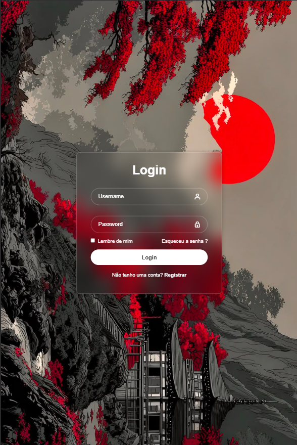

# Login Page

Tela de login responsiva feita com HTML e CSS puro, com efeito de vidro fosco (glassmorphism) sobre uma imagem de fundo temática, e ícones da biblioteca Boxicons.

## 🔍 Preview



Visite o site aqui: https://elielhon.github.io/login/

## ✨ Funcionalidades

- Campos de usuário e senha com ícones
- Checkbox "Lembre de mim"
- Link "Esqueceu a senha?"
- Link para tela de registro
- Design responsivo com efeito glassmorphism (blur)

## 🛠️ Tecnologias

- HTML5
- CSS3
- [Boxicons](https://boxicons.com/)

## 🚀 Como usar

Basta clonar o repositório e abrir o `index.html` no navegador:

```bash
git clone https://github.com/eliehon/login.git
cd login
```

## 👤 Autor

Eliel Honório
